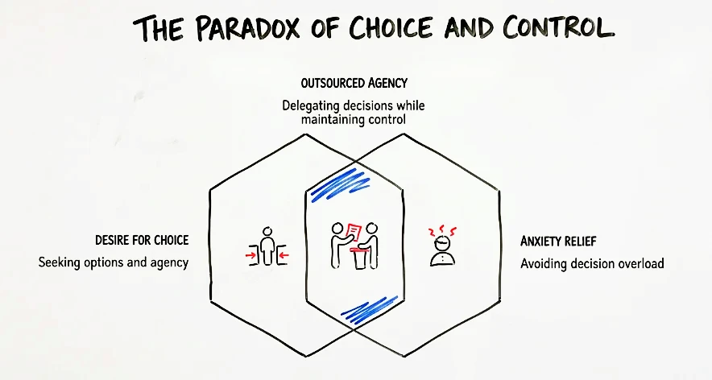

## When choice stops feeling like freedom

*"We say we love choice."* Past a point, it **turns on us**. When stakes rise, you stop chasing the best option and start chasing **relief from anxiety**. That shift is the whole trap: you still want to feel in charge, even when you are not doing the choosing.

> The menu grows faster than your nerve to pick.

## Outsourced decisions, owned story

You want options, but you let **defaults** or people you trust decide, as long as it still feels like *your* choice. Plans stack up, shelves never empty, feeds keep serving more; you hand the call to **pre-set defaults** or experts and protect one story: "**I am still in control**."

Law and politics copy the same script. You vote. Specialists and institutions carry the real load. You keep the **story of agency**. They carry the work and the blame when things go wrong.

## When the brakes come off

Psychopathic traits **hack this setup**. Low fear, low guilt, and weak regret remove the **brakes** that freeze most people. In complex, high-stakes situations, acting feels easy. Picture the crisis call where everyone else freezes; they move.

In systems built on **delegation** and avoidance, that looks like an **edge**, and it makes power fragile and harmful, because the same **numbness** that kills anxiety kills feedback, empathy, and correction.

> Notice when you are **handing the choice off**. That part is still yours.

Research on the **need for control** ties choice to **perceived control** and corticostriatal reward circuits; when choosing feels costly, people cling to **pre-set defaults**. [Born to choose: the origins and value of the need for control (PMC)](https://pmc.ncbi.nlm.nih.gov/articles/PMC2944661/)
