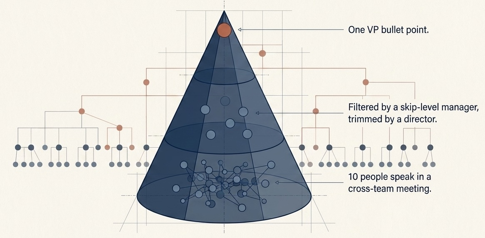

## Why does every group organize into a pyramid?

Families get elders. Classrooms get teachers. Armies get ranks. Companies get managers. Online communities get moderators, influencers, and inner circles, even when they begin with **flat ideals**.

Culture and greed matter, but the deeper reason starts **inside the body**: the human brain already **stacks the world in layers**.

Low-level signals get grouped into patterns, patterns get grouped into concepts, and concepts get routed through brain networks that decide what matters next.

## Your cortex stacks bosses before HR does

The **cortex** (the brain's outer wrinkled layer) stacks work in layers. Sensory systems move from simple features toward richer abstractions. Motor systems stack local movement under broader action plans. **Executive systems** (the brain networks that set and hold goals) keep those goals above immediate impulses.

The brain solves complexity by building **nested control**: local systems do local work, while higher systems compress, compare, and redirect. Authority sits in those layers, a stack of small bosses instead of one *tiny king*.

If you can track which sound matters, which movement matters, and which goal overrides which impulse, you can also track **rank in the room**: whose anger matters, whose approval changes your options, and whose signal reorganizes the room.

## Rank in the skull before the org chart

**Zink et al.** ran a lab game where volunteers learned who outranked whom from other players' faces alone. When their rank rose or fell, brain scans lit **the same reward and control networks that respond to money**.

A team of ten can run on memory, trust, and direct talk. At company scale, signals and disputes outrun that. The group **trades detail for speed** through **fewer paths up the chain**: one report line, one roll-up, one answer upstairs.

Ten people spoke in a cross-team planning meeting; the VP got one bullet from a skip-level report (one level above your manager), trimmed by a director, shaped by whoever could block the roadmap.

Pyramids compress many local realities into fewer steering points (easier to steer, blame, and obey) but breed bottlenecks, status games, and a gap between **the person who decides** and **the people who eat the cost**. The ladder that coordinates can teach that **thinking stops at your layer**.

## Rank comes back unless you design against it

Brains can handle networks, rotating roles, and **heterarchies**: the lead changes by domain (finance vs product), a different boss for a different kind of call. Humans can design councils, juries, cooperatives, and other forms that resist simple top-down control.

Co-ops and open-source projects that last use **explicit counter-design**: written processes, visible decisions, rotation of who can merge.

On paper, a startup can be flat. In practice, **the room orbits the founder**. A forum can ban visible ranks and still **orbit the mod with the delete button**. Without that counter-design, hierarchy returns because it is easy to read, imitate, and justify once it exists.

> **Hierarchy is an attractor.** Groups keep sliding into a pyramid because attention already climbs in layers.

[Know Your Place: Neural Processing of Social Hierarchy in Humans](https://pmc.ncbi.nlm.nih.gov/articles/PMC2430590/) (Zink et al., 2008, PubMed Central)
