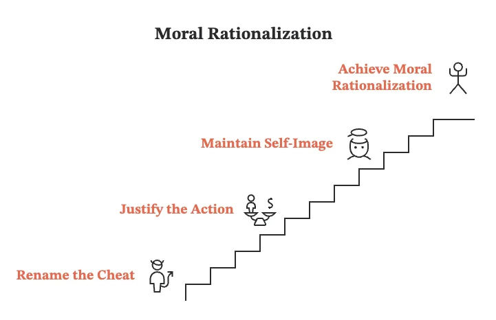

## Look fair. Then cheat.

We can cheat, because we are the **good guys**.

In Monin and Miller's studies, people first rejected a blatantly sexist statement, then chose a man over a woman for a job labeled male. Looking fair on the first screen made the biased hire on the next one easier to live with.

Researchers call this pattern **moral credentialing** (proving your virtue to make later shortcuts easier). It’s like a hall pass for your conscience.

> Proving you are a good person acts as a **license** to misbehave later.

## Rename the cheat so it still fits

After the virtue proof, your head starts rewriting the next move. This is where **moral rationalization** comes in: you rename the shortcut until it matches the self-image you refuse to drop.

You tell yourself: *"I’ve already proved I’m fair, so this one small tilt is fine."* Or: *"I’m generous, so taking this win still leaves me a good person."* The cheat becomes "fair compensation." Prejudice becomes "fit." A grab for yourself becomes "being practical."

## Build the halo on the way in

You do not always need a real good deed from last week. Right before you bend the rule, you can **invent** one: *"I’ve always supported women,"* or *"everyone knows I’m honest."*

You can also borrow the **group badge**: we are the defenders of X, so our rough tactics are justified. The badge stays loud for everyone else, while we read the fine print only we get to see.

## When the license shrinks

The badge stops paying when the excuse stops working. In math cheat tasks, people cheated more when they could say *"I was too slow"* to hide the answer. When the delay was too long to be an accident, the earlier virtue rating barely moved them.

We pull back when the act would force us to admit *"I am a cheater,"* or when watchers make reputation costly. But fear of a **last chance** can shove the same cheat through: you use the halo to quiet guilt while you grab before the window closes.

Our game is your game, but not ours. Thick rulebook for **you**. Blank for **us**.

🔖 [Moral Credentialing and the Rationalization of Misconduct (PMC)](https://pmc.ncbi.nlm.nih.gov/articles/PMC3077566/)
