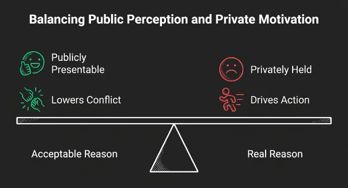

## El relato público es una capucha de negabilidad

Cuando renuncias a un empleo, cierras un trato o eliges bando, sueles soltar la versión que suena justa, sensata o amable. Esa **razón aceptable** es la que mejor se vende: suaviza el conflicto, protege tu **imagen** y les da a los demás un hueso que pueden roer sin hacer demasiadas preguntas.

> Ese relato funciona como una **capucha de negabilidad**: un disfraz que impide que nadie señale el **motivo real**.

En un grupo, evita que las **sospechas** se vuelvan **certezas compartidas**. En solitario, nos permite seguir actuando mientras nos convencemos de que nuestra **imagen** sigue **impecable**.

## La verdad que no queremos ver

El **impulso real** suele ser más crudo: **estatus**, rencor, miedo a parecer débiles o ansia de **control**. A veces lo sabemos y simplemente lo maquillamos. Otras veces, el motivo se queda en la **penumbra**.

El cerebro se encarga de **suavizar** o **enterrar** cualquier intención que pueda manchar la **autoimagen**. Los psicólogos lo llaman la **brecha de empatía frío-calor** (*cold-hot empathy gap*): en frío somos incapaces de sentir de verdad qué es lo que nos moverá cuando el **miedo** o la **ira** tomen el mando.

## Mira debajo del disfraz

Podemos mentirle al mundo a **sangre fría**, pero también podemos acabar **creéndonos nuestro propio cuento**. En cualquier caso, el **impulso real** sigue ahí, apretando el acelerador, mientras el "porqué" aceptable es solo lo que decimos para que nos dejen en paz.

Cuando te den una explicación impecable (o cuando te la des a ti mismo), detente un momento.

¿De qué nos protege esa **buena razón** ante los demás? ¿Y qué persigue el **impulso** que solo asoma cuando **nadie mira**?

---

[Have We Vindicated the Motivational Unconscious Yet? (PMC)](https://pmc.ncbi.nlm.nih.gov/articles/PMC3180639/)
