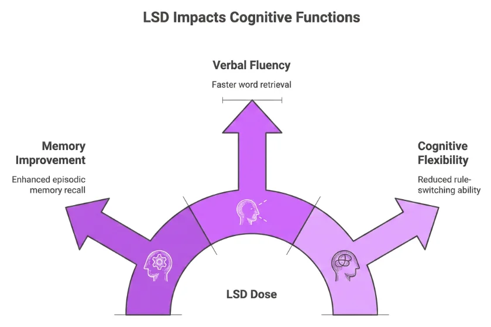

## Una historia que se me quedó grabada

Cuando estaba en la universidad, uno de mis compañeros de piso me contó una historia que se me quedó grabada durante años. Tenía un amigo que iba **siempre a clase bajo los efectos del LSD**. Sin cuadernos ni portátil, y supuestamente **aprobaba todos los exámenes**.

Ahora que la investigación psicodélica está **en boca de todos**, de repente esta historia me volvió a llamar la atención. Los psicodélicos clásicos como el LSD abren una breve **ventana de neuroplasticidad**: un estado en el que el cerebro **reconecta sinapsis** con mayor facilidad **durante horas o incluso días** después de la dosis.

## Qué dicen realmente los estudios

Un estudio con **dosis bajas de LSD**, evaluado **al día siguiente**, encontró una mejora en la **memoria episódica** y la **fluidez verbal**, pero una peor **flexibilidad cognitiva** en tareas donde las **reglas cambiaban sin previo aviso**.

Las revisiones científicas confirman este patrón: tras una dosis, se altera la expresión de **genes de plasticidad**, la **morfología dendrítica** y la **fuerza sináptica**, con efectos que perduran más allá de la **experiencia aguda**. Eso encaja con una **ventana de plasticidad** temporal, no con un "recableado" permanente. Aunque las señales en humanos son más ruidosas, **la tendencia es clara**.

## Mejor memoria, peor adaptación

Esa mezcla de capacidades al día siguiente se parece mucho al **overfitting** en machine learning: los **datos recientes cobran un peso excesivo**, lo que dispara la capacidad de recuerdo pero hunde la capacidad de **adaptarse a nuevas reglas**. Podría decirse que es un sesgo temporal hacia **lo que tienes delante**; a cambio de una memoria más aguda, pierdes la **flexibilidad** para actualizar tu modelo mental.

> Ningún artículo científico utiliza *overfitting* para hablar de la cognición con LSD; es una **analogía**, no neurociencia establecida.

## Qué significaría para la historia

Con este marco, la historia de mi compañero deja de ser **magia pura**. Si **repites la misma clase** con un cerebro con la plasticidad aumentada y una **tendencia casi obsesiva** a grabar lo que tienes delante, podrías fijar esas lecciones con una **fuerza inusual**.

Nunca verifiqué la anécdota, y esto **no es una recomendación**. Es una lectura **especulativa** de por qué historias de exámenes sin apuntes suenan menos imposibles, no prueba de que pasaran.

[LSD, afterglow and hangover (PubMed)](https://pubmed.ncbi.nlm.nih.gov/35158230/) · [Towards an understanding of psychedelic-induced neuroplasticity (Nature)](https://www.nature.com/articles/s41386-022-01389-z)
