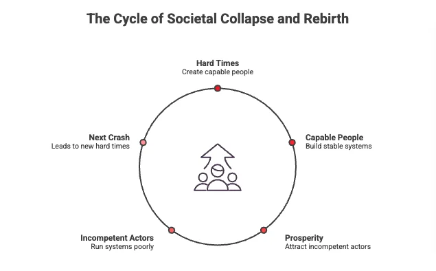

## Feeds that reward noise over skill

Engagement-driven feeds rank by **clicks** and **watch time**. They reward **attention-seeking** and *performative* identity. That speeds up the **weak-men phase** of the **Hopf cycle**: **shallow performers** rise ahead of competent people, and institutions slide toward **failure faster**.

> Hard times create strong men, strong men create good times, good times create weak men, and weak men create hard times.

## Not an ancient proverb

G. Michael Hopf wrote that line in *Those Who Remain* (2016), after reading generational-cycle theories like Strauss and Howe's *The Fourth Turning*. It is **not** an ancient proverb. It compresses their roughly **80-year** model of stability, decay, and crisis into four beats.

Hard times produce **capable people**. Capable people build **stable, prosperous systems**. Prosperity lets **narcissistic, incompetent actors** rise; they run the system poorly and set up the **next crash**.

## Outrage spikes the signal

In the algorithmic age, **outrage** and **self-promotion** spike those ranking signals, so the system **boosts** **performers over builders** and turns influencer culture into a **narcissism factory**.

> When the feed is the scoreboard, loud ranks over competent.

## Search and recommendations follow the loudest voice

You see it when **loud creators** outrank **domain experts** on search and recommendations, and decisions follow the **loudest voice**. That shortens the **weak-men phase** and pulls the **next crisis** closer.

G. Michael Hopf, *Those Who Remain* (2016) · Strauss & Howe, *The Fourth Turning* (1993)
