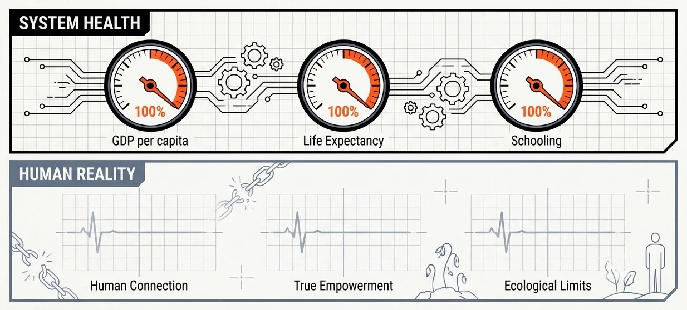

## Los países desarrollados puntúan la máquina, no tu vida

*«¿Te fijaste en que seguimos tratando los países desarrollados como la meta final?»* Seguimos **aspirando** a las naciones ricas. El **IDH** mezcla esperanza de vida, escolaridad e ingreso; el PNUD dice que solo captura en **parte** el desarrollo humano. El **Informe Mundial de la Felicidad** se apoya en PIB, salud y encuestas. Ambos miden sobre todo **cómo rinde el motor**, no cómo **vives**, te **relacionas** o te **sientes**. Nadie habla de cómo **pierdes el tiempo que tienes para los tuyos**.

> Los rankings premian el motor. **No** miden un vínculo de verdad.

## Fábricas bien mantenidas

Les llamamos **fábricas bien mantenidas**. Son [sistemas hechos para durar](https://behaviorengineering.ai/social-protocols/2026-05-05-built-to-last/) (un estándar alto para una **máquina**, pero **no** es lo mismo que una **sociedad desarrollada**).

Un *«país desarrollado»* es una **máquina de alto rendimiento**:

- Mucho PIB, servicios que funcionan y una burocracia que lo abarca todo.
- Gente sana y educada, ocupada para **trabajar y consumir**.
- Reglas impuestas en la calle; **cada quien vigila al otro** para que nadie se salga de la fila.
- **Crecimiento** primero. El **poder** se queda donde está.

> Cuando el motor va más rápido, **no queda tiempo** para las conexiones.

## Algunas fábricas amortiguan; el poder sigue arriba

Hay países que **suavizan el golpe**: salud y educación para la mayoría, pensiones, seguro de desempleo, leyes que protegen al trabajador, un poco más de calidad de vida y libertad personal, y una red que te ataja si caes.

Australia, Nueva Zelanda, Canadá y partes de Europa Occidental encabezan los rankings de *«felicidad»* y *«libertad»*. Los nórdicos suelen poner **bastantes frenos y contrapesos** para que el sistema **no** reviente a quienes viven ahí.

El salto de verdad llega cuando la ciudadanía **le pone un freno al Estado** (Islandia metiendo presos a sus banqueros, Suecia empujando transparencia radical). Ahí el poder deja de concentrarse en un grupo pequeño. Es **raro**. Solo pasa cuando bastantes personas **empujan**, y casi nunca queda **energía** para eso.

## Cuando la vida va al centro, no la productividad

Una sociedad que de verdad funciona pone la **vida** en el centro. **No** va de esquivar el trabajo. Va de hacer algo que **sostenga a los tuyos**, en lugar de solo **echarle carbón a la máquina**.

Eso voltea tus prioridades:

- **La familia y la tribu**, no la productividad.
- **El dinero al servicio de la vida**, no al revés.
- **Autonomía real**: poder parar sin quedarte en la calle.
- **Pensamiento propio**: no solo obedecer órdenes.

Modos de vida indígenas, cooperativas y experimentos como Bután muestran la forma. **Ninguna nación moderna** lo ha logrado a escala. *¿Para qué arreglar lo que no está roto* si te está **desgastando**?

## La fábrica no va a frenar por ti

Las fábricas **no se hicieron para cambiar**. Se hicieron para **producir**. **No** puedes reconstruir una fábrica mientras está en marcha.

Aceptar la realidad **no** te obliga a renunciar al futuro. Todo arranca por la **imaginación**: el cerebro evolucionó para simular realidades que aún **no** existen y luego construirlas. Usa tu tiempo, tus habilidades y tus grupos pequeños para construir un **futuro distinto**, no para acelerar la vieja fábrica.

*¿Cómo sería un marcador que midiera tiempo con los tuyos, no solo producción?*

> La fábrica **no** va a frenar por ti. **Construye algo distinto**, o te vuelve a tragar.

[Índice de Desarrollo Humano (PNUD)](https://hdr.undp.org/data-center/human-development-index) · [Sagar & Najam 1998](https://www.belfercenter.org/publication/human-development-index-critical-review) · [Metodología del Informe Mundial de la Felicidad](https://www.worldhappiness.report/about/)
