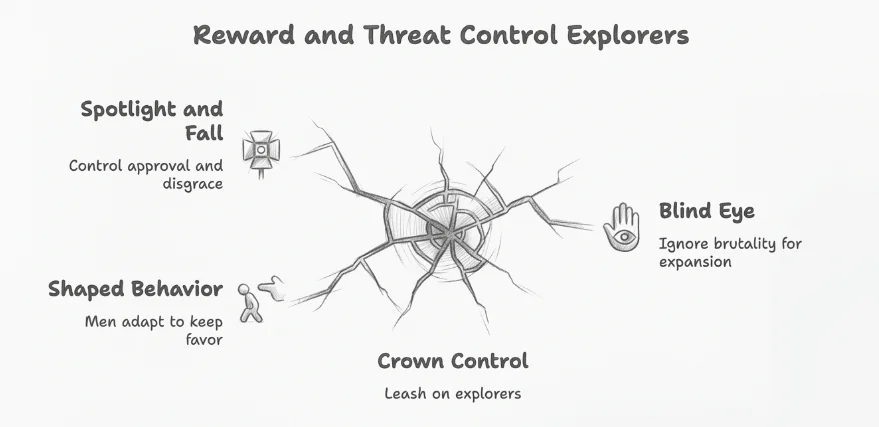

## Heroism on the surface, asset under glass

**Narcissistic style** reads like **singular heroism**. To the machinery behind it, that posture is just a **useful asset under glass**.

Colonial projects did not stumble into this. They turned narcissism into a **deliberate weapon**: self-regard, entitlement, and disregard for others justified taking and keeping power, and elevated people willing to conquer, dispossess, and destroy **without remorse**.

## Who the system kept selecting

Look at who rose and how they behaved. The men who led the conquest of the Americas, Hernán Cortés and Francisco Pizarro, chased extreme ambition with ruthlessness and grandiosity. English explorers like Sir Francis Drake and Sir Walter Raleigh followed the same mold. **Systems kept selecting for this.**

That mix of grandiosity, ruthlessness, and ambition made them willing to take big risks and do **ugly things**. They chased dangerous expeditions, made brutal decisions, and pursued **glory at any cost**. They acted **without remorse**, which drove conquest and the harm that came with it.

## Crowns knew how to steer the leash

**This gets shaped, not just born.** The system rewards it, so it grows.

European monarchies understood this psychology and used it on purpose. Crowns appealed directly to grandiosity by offering **titles, lands, and prestige** (Cortés became Marqués del Valle de Oaxaca). They granted **autonomy and a share of spoils**, so fortunes could grow while serving the empire. They set up a race for new territories, turning those traits into an asset.

Crowns kept these men on a leash, and those men leaned into it because it paid. They handed out titles, praise, and access, then made all of it conditional; the men shaped themselves to keep them. Win, and you stay in favor. Slip, and you face disgrace or exile.

That mix of **reward and threat** kept them hooked, chasing approval and fearing the drop. You do not need constant force when you control both the **spotlight** and **the fall**.

Monarchs often turned a blind eye to brutal methods as long as explorers expanded the empire. Crowns and backers kept rewarding those traits, while staying **one step removed** from the violence.

> **No one here is purely a victim.**
>
> The system worked because people wanted what it offered.

## What intelligence services wrote down

The insight that **heavy narcissistic traits** produce **manipulable agents** was later formalized by intelligence services. The CIA spells it out:

> Deep hunger for affirmation that makes them vulnerable to manipulation, particularly by people whose admiration or approval they desire.

People running that pattern are *especially* sensitive to approval from authorities or socially powerful figures. This is exactly the **power gradient** at work in colonial projects: **the power at the top**, **the ambitious operator below**, hungry for glory and terrified of shame.

CIA clinical psychologist Ursula Wilder discusses narcissism as part of the *"dark tetrad"* in world leaders, noting they are driven by dreams of glory while defending against shame and humiliation. Research on **vulnerable narcissism** ties heavy approval-need and shame fear to **status-based steering**, including in people who **never held a clinical label**.

## The habit outlived the maps

Colonial rule was not only land grabs. It locked **who got the hero slot** and who got treated as **scenery**. **Law, schools, and budgets** kept running that sort after the maps were redrawn.

**Modern hierarchies** still carry that habit:

- **Eurocentric beauty ideals** and language hierarchies
- Continued preference for **"conqueror" leadership** styles in technology, politics, and global markets
- Protection of **boundary-pushing leaders** whose results matter more than the damage they cause

Modern systems still prioritize the advantage leaders gain when they lean hard on narcissistic traits, over the ethical costs. The same dynamic repeats: societies enable dangerous traits, **trading results for ethics**, over and over. **And you still feel it**, in what gets rewarded and what gets ignored.

## Seeing the mechanism is the first cut

Breaking this cycle requires seeing the psychological impact: **reclaiming histories** and traditions erased by colonial education; **restoring equal human dignity** beyond colonial hierarchies; **understanding how approval-seeking and shame** were weaponized, and how they still operate in institutions today.

The first step is seeing **the mechanism** clearly: narcissism served as a deliberate tool of conquest. It was wielded, and later formally studied, **because it works**.

> Look behind the curtain. There is always someone handing out praise and pulling the strings.
>
> Sometimes, **that is yourself**.

[The Psychology of Espionage (PDF)](https://www.cia.gov/resources/csi/static/psychology-of-espionage.pdf) · [Wilder on profiling world leaders (CBS News)](https://www.cbsnews.com/news/cia-clinical-psychologist-ursula-wilder-on-profiling-world-leaders-intelligence-matters/) · [Durham: narcissism and abusive supervision](https://durham-repository.worktribe.com/output/1331520/vulnerable-narcissists-in-leadership-a-bifactor-model-of-narcissism-and-abusive-supervision-intent)
